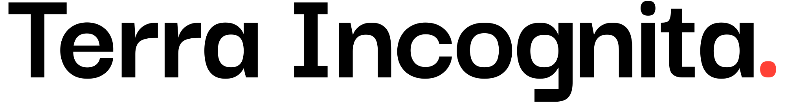

<!-- Desain Markdown ini terinspirasi dari repositori resmi Zed Browser. -->  
<!-- Sumber: https://github.com/zed-industries/zed/blob/main/README.md -->

Lisensi bisa ditemukan disini

  Untuk dokumentasi dalam bahasa asli, silakan lihat <a href="/readme.md">file ini</a>.
   

  <a href="https://github.com/archangel-12/t_core">
    <strong>Jelajahi dokumentasi</strong>
  </a>
  ||
  <a href="/changelog.md">
    <strong>Perkembangan sejauh ini</strong>
  </a>

 

  
Daftar Isi

  <ol>
    <li>
      <a href="#apa-ini">Apa ini?</a>
    </li>
    <li>
      <a href="#hah-maksud">Hah, Maksud?</a>
    </li>
    <li>
      <a href="#kenapa-saya-membuat-proyek-ini">Kenapa saya membuat proyek ini?</a>
    </li>
    <li>
      <a
        href="#alat-dan-plugin-apa-yang-digunakan-dalam-proyek-ini"
        >Alat dan plugin apa yang digunakan dalam proyek ini?</a
      >
    </li>
    <li><a href="#roadmap">🗺️ Peta</a></li>
  </ol>

 

### Apa ini?
> Ini adalah *chatbot*, tetapi dikhususkan untuk Sejarah! 🤗

### Hah, maksud?
``Ti.`` adalah chatbot khusus yang dirancang untuk memberikan respons yang presisi dan terstruktur terkait peristiwa sejarah, tokoh, dan konteksnya. Sebagai pengembang, saya menyadari bahwa __proyek ini belum sempurna__, tetapi saya yakin ini adalah bukti bahwa kecerdasan buatan memiliki potensi besar jika digunakan dengan bijak. Selama kita memakainya dengan cara etis, kita bisa menciptakan solusi inovatif dan bermakna yang menginspirasi kreativitas serta penemuan.

### Kenapa saya melakukannya?
Saya selalu menyukai konsep pendekatan multidisiplin dalam pendidikan, itu membuat segalanya lebih menarik. Penelitian juga menyenangkan, meskipun fokus saya mungkin sedikit berbeda dari lulusan humaniora yang biasanya menganalisis artefak atau situs arsip. Namun, proyek ini lebih dari sekadar penelitian. Sekali lagi, ini adalah cara saya menunjukkan bagaimana KB, jika digunakan dengan benar, dapat membuka berbagai penemuan yang kreatif dan bermakna. Mungkin belum sempurna, tetapi hei, itulah bagian dari perjalanannya!

### 🗺️ Roadmap
| Fase | Timeline | Pencapaian | Status |
|------|----------|------------|--------|
| **Konsep & Perencanaan** | Mid-2023 – Nov 2023 | Ide awal dirancang | ✅ Selesai |
| **Jeda Karena Operasi dan KKN, serta magang mengajar** | Nov 2023 – 2024 | Proyek tidak tersentuh | ❌ Ditunda |
| **Desain & Prototipe** | Nov 2024 – Jan 2025 | Pengembangan awal desain dan prototipe | ✅ Selesai |
| **Demo Pertama** | Feb 2025 | Demonstrasi fungsionalitas berhasil | ✅ Selesai |
| **Iterasi & Penyempurnaan** | Mar – Apr 2025 | Peningkatan UI/UX & penulisan draft skripsi | ✅ Selesai |
| **Jeda Pengembangan** | Mei 2025 | Tidak ada progres proyek | ❌ Ditunda |
| **Perbaikan Bug & Pemulihan** | Juni 2025 | Memperbaiki bug akibat copy-paste kode V0 | ✅ Selesai |
| **Progres Saat Ini** | Juni 2025 | Kunci API dan sistem autentikasi berfungsi | ✅ Selesai |
| **Hari Presentasi** | 4 Juni 2025 | Demonstrasi proyek & iterasi berlanjut | ✅ Selesai |
| **Validasi dari teknisi**       | 12 Juni 2025 | Presentasi berupa progress saat ini | ✅ Selesai |
| **Wawancara dengan junior**       | 18 Juni 2025 | Observasi berupa pengalaman mahasiswa ketika pertama kali memakai `Ti.` | ❌ Ditunda |
| **Izin diberikan** | 23 Juli 2025 | Izin resmi diberikan untuk melewatkan pengembangan *backend* oleh dosen. Ini berarti fokus penuh sekarang dapat didedikasikan untuk antarmuka dan integrasi KB, merampingkan kemajuan dan mengurangi tekanan lingkup | ✅ selesai
| **Penyempurnaan Akhir** | Juni 2025 - 26 Agustus | Perbagus antarmuka, automasi *Clerk*, ~~dan integrasi Supabase~~ sebelum *rilis ke publik* | ✅ selesai |
| **Wawancara dengan junior ke 2 kalinya**       | 30 Juli 2025 - Agustus 2025 | Observasi berupa pengalaman mahasiswa ketika pertama kali memakai `Ti.` | ✅ selesai |
| **Data akhir sebelum sidang**       | November - Januari 2026 | Input data akhir sebelum sidang akhir  | ✅ selesai |
| **Sidang**       | 25 Februari 2026 | Sidang akhir untuk demonstrasi produk final  | ✅ selesai |